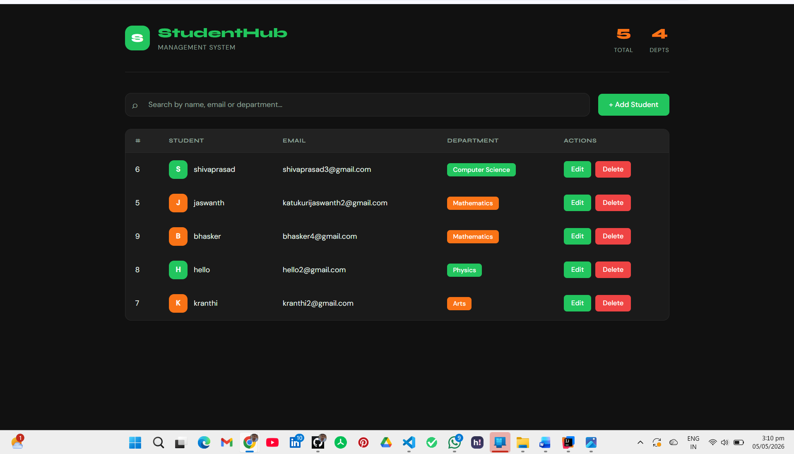
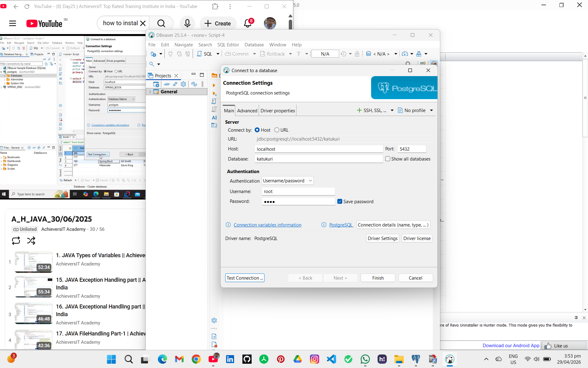

# 📚 Student Details Management System

A full-stack web application to manage student records efficiently. This system allows users to perform **CRUD operations** (Create, Read, Update, Delete) on student data with a modern UI and robust backend.

---

## 🚀 Tech Stack

### 🔹 Frontend
- React.js
- Axios
- Tailwind CSS
- Props (State Management)
- Vite (Build Tool)

### 🔹 Backend
- Java
- Spring Boot
- RESTful APIs

### 🔹 Database
- PostgreSQL

---

## 📸 Project Preview

<p align="center">
  
</p>

---

## 🏗️ Architecture

This project follows a clean layered architecture:

<p align="center">
  
</p>

---

## ✨ Features

- ➕ Add new student details
- 📋 View all student records
- ✏️ Update student information
- ❌ Delete student records
- 🔍 Search & filter functionality
- ⚡ Fast and responsive UI
- 🔗 Seamless frontend-backend integration using REST APIs

---

## 🔧 Technical Problem Solving

### 🔒 CORS Configuration & Port Stability Fix

One of the real-world challenges faced during development was **CORS (Cross-Origin Resource Sharing)** configuration between the Spring Boot backend and React frontend.

**Problem:**  
Vite (the React build tool) was auto-incrementing the dev server port — jumping from `5173` to `5174`, `5175`, etc. — whenever the port was already in use. This caused the Spring Boot `@CrossOrigin` annotation to break since it was configured for a fixed port.

**Backend configuration:**
```java
@CrossOrigin(origins = "http://localhost:5173")
@RestController
public class StudentController {
    // ...
}
```

**Solution — Locking the Vite port using `strictPort`:**

```js
// vite.config.js
import { defineConfig } from 'vite'
import react from '@vitejs/plugin-react'

export default defineConfig({
  plugins: [react()],
  server: {
    port: 5173,
    strictPort: true  // Prevents Vite from switching to another port
  }
})
```

> Setting `strictPort: true` forces Vite to **throw an error** instead of silently switching ports — ensuring the frontend always runs on `5173` and stays in sync with the backend CORS policy.

This demonstrates understanding of **cross-origin policies**, **dev environment configuration**, and **debugging full-stack integration issues** — skills critical in real-world development.

---

## ⚙️ How to Run

### Backend (Spring Boot)
```bash
cd StudentDetailsBackend
./mvnw spring-boot:run
```

### Frontend (React + Vite)
```bash
cd SpringBootFrontend
npm install
npm run dev
```

> The app will open at **http://localhost:5173**

### Database
- Make sure PostgreSQL is running
- Configure your DB credentials in `application.properties`

```properties
spring.datasource.url=jdbc:postgresql://localhost:5432/katukuri
spring.datasource.username=postgres
spring.datasource.password=i gave "root"
```

---

## 📁 Project Structure

```
StudentDetails/
├── StudentDetailsBackend/        # Spring Boot Backend
│   └── src/main/java/
│       ├── controller/
│       ├── service/
│       ├── repository/
│       └── model/
└── SpringBootFrontend/           # React Frontend
    ├── src/
    │   ├── assets/
    │   ├── components/
    │   └── App.jsx
    └── vite.config.js
```

---

## 🤝 Contributing

Pull requests are welcome! For major changes, please open an issue first.

---
